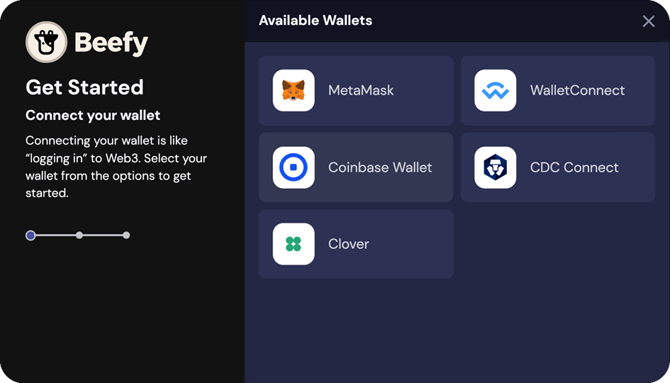

# Connecter votre portefeuille à Beefy

Maintenant que vous avez créé un portefeuille et que vous avez approvisionné celui-ci en crypto, il est temps de connecter votre portefeuille à Beefy !

### 1. Cliquez sur le bouton "Connect Wallet".

Ce bouton se trouve en haut de la page :

.png>)

### 2. Sélectionnez votre portefeuille dans les options

 (1).png>)

### 3. Approuver la connexion

Tout est fait ! Vous êtes maintenant prêt à explorer les coffres de Beefy et d'autres opportunités de gains.


[how-to-deposit-in-a-vault.md](../faq/how-to-guides/how-to-deposit-in-a-vault.md)
