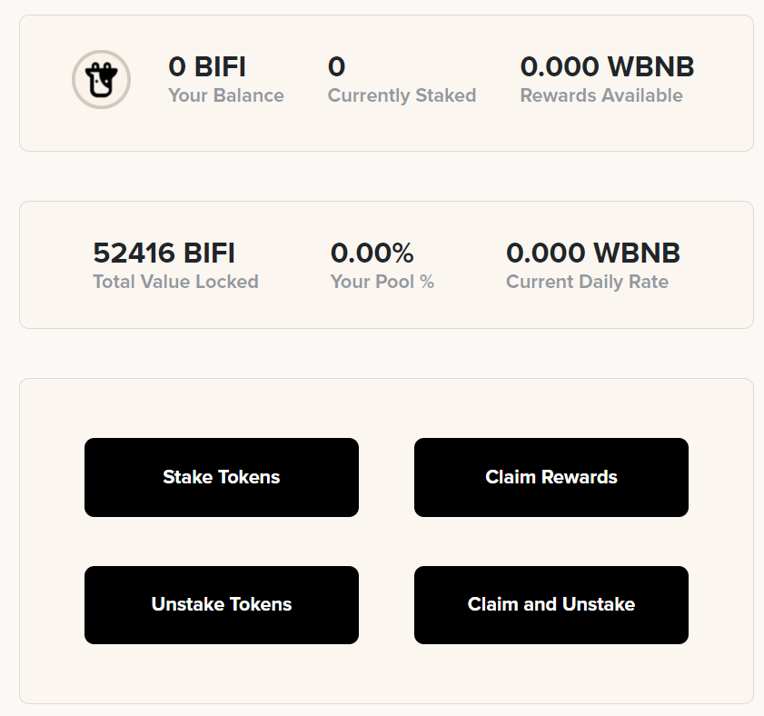

# Governance

BIFI holders govern the Beefy ecosystem and are eligible to receive a portion of vault performance profits. Therefore, holding BIFI represents your stake in governing the platform and a claim on earnings. Profits are obtained from each of Beefy's products. 

In order to claim profits, BIFI holders stake their tokens into the [Governance pool](https://gov.beefy.finance/stake). Profits are sent daily to this pool in the form of WBNB. The amount of profits you are entitled to daily, as a BIFI holder, is determined by the number of BIFI staked \(% of pool\) multiplied by the daily pool reward. These profits can be withdrawn at any time without penalty or needing to un-stake your BIFI.

There is no need to un-stake from the [Governance pool](https://gov.beefy.finance/stake) in order to vote on changes to the Beefy ecosystem. The platforms snapshot system takes into consideration the BIFI tokens in wallets and in the Governance pool. All stakeholders will continue to receive pools rewards as well be able to withdraw profits at any time during the voting process. 

