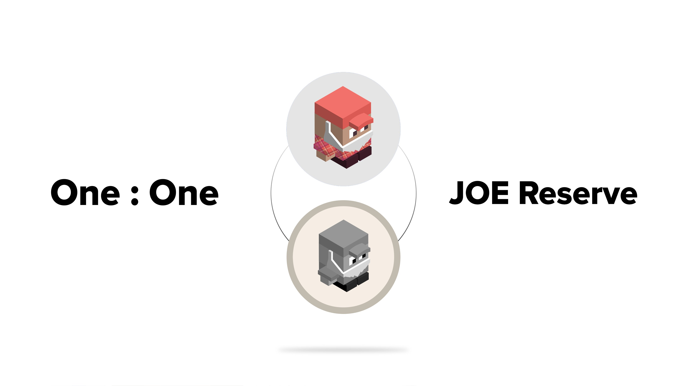

# beJOE

## ¿Qué es JOE? 

JOE es el token nativo de Trader Joe, un exchange descentralizado en Avalanche. Premia a los tenedores con una parte de los ingresos de la plataforma y también actúa como token de gobernanza. JOE tiene un suministro fijo y un modelo de emisión decreciente.

Los usuarios pueden stakear JOE para ganar veJOE y recibir recompensas potenciadas de JOE en granjas seleccionadas de Trader Joe y poder de voto en la gobernanza.

## ¿Qué es beJOE?

beJOE es una versión wrappeada de JOE por Beefy que se stakea para ganar veJOE, maximizando las emisiones en los vaults potenciados de Beefy. Los stakers de beJOE ganan el 5% de las emisiones de esos vaults potenciados.

El token está totalmente respaldado 1:1 por JOE y puede ser canjeado por JOE en reserva. Esta reserva sólo se llena cuando un nuevo usuario deposita.

## ¿Cómo se consigue beJOE?

Puedes mintear beJOE en la página de el vault de beJOE en una proporción de 1:1. No habrá liquidez incentivada para beJOE, en su lugar habrá una reserva de retirada.

## ¿Cómo funciona beJOE?

Si las reservas de JOE superan la cantidad suficiente, Beefy stakeará el 80% de los JOE depositados para ganar veJOE y mantendrá el 20% en la reserva de retirada. Por cada vault potenciado, Beefy desviará el 5% de lo recolectado a la reserva de recompensas de veJOE.

A medida que los usuarios depositen más JOE, Beefy los retendrá hasta que activemos la bonificación de aceleración de veJOE. Esto ocurrirá en incrementos del 5% de la cantidad total actualmente stakeada en veJOE.

Si las reservas de JOE son bajas, entonces todos los JOE depositados se reutilizarán para llenar las reservas.

## ¿Qué puedo hacer con beJOE? 

Una vez que tengas beJOE, hay un par de opciones disponibles. Puedes hacer staking en el:

1. Vault para ganar más beJOE
2. Pool de ganancias para ganar JOE

## Pero, ¿qué pasa con las comisiones? 

Beefy tiene las comisiones de optimización de rendimiento más bajas de Avalanche. Con las nuevas granjas potenciadas de beJOE, usted gana más que en cualquier otro lugar. Beefy cobra sus comisiones normales de rendimiento del 4.5% en vaults potenciados más un 5% adicional entregado directamente a los stakers de beJOE.

## ¿Cómo hace beJOE para mantener su peg?

No se provee liquidez para beJOE, por lo que siempre estará a 1:1 con JOE. Los usuarios pueden quemar beJOE por JOE mientras dure la reserva. Esta reserva sólo se llena cuando un nuevo usuario deposita.

En un escenario de último recurso, todos los JOE bloqueados en beJOE pueden ser desbloqueados y liberados a la reserva. Los competidores de Beefy no tienen esto. Sin embargo, esto también pondría fin a los potenciadores disponibles para los vaults de Beefy y las recompensas que se transmiten a la reserva de recompensas de beJOE, por lo que es poco probable que se active.

## ¿Puedo votar con beJOE? 

Todavía no, pero beJOE implementa el EIP-1271 (validación de la firma para los contratos), por lo que se puede organizar la futura gobernanza y sobornos con TraderJoe
