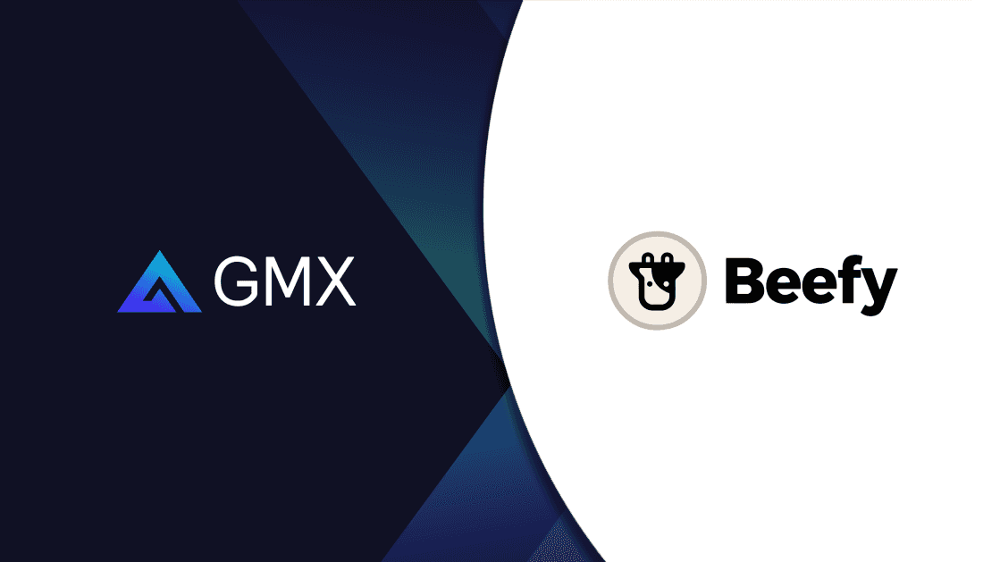

# GMX and GLP

<figure><figcaption></figcaption></figure>

## What is GMX?

[GMX](https://app.gmx.io/#/trade/?ref=beefy) is a multi-chain decentralized exchange on Arbitrum One and Avalanche, letting you easily trade perpetual futures. On the GMX DEX, you can trade BTC, ETH, AVAX, LINK, and UNI with up to 30x leverage from your self-custodial crypto wallet.

As a trader, you enter and exit your positions with zero price impact, while profiting from minimal spreads and deep liquidity. Reliable price data is realized by aggregating price feeds, so users also benefit from lowered liquidation risks.

## What is GLP?

GLP is a token minted to liquidity providers on GMX. GLP represents an index of assets, used for leverage trading and swaps on the GMX platform. You can mint it using any of the index assets and burn it to redeem any of the index assets. The cost of minting and redeeming is calculated based on:

_(the total worth of assets in the index including profits and losses of open positions) / (GLP supply)_

After minting GLP, it’s automatically staked to earn escrowed GMX (esGMX, an escrowed version of GMX’s utility and governance token), multiplier points, and ETH or AVAX rewards depending on the network.

## How does Beefy's GLP strategy work?

Beefy is creating two new Vaults, each one taking GLP deposits on either Arbitrum or Avalanche. To mint GLP, you’ll have to deposit an asset contained in the GLP index on GMX as outlined previously. GLP is not bridgeable between Arbitrum and Avalanche.

The strategy works as follows:

1. Users stake GLP in one of the two Beefy Vaults: [The Arbitrum GLP Vault](https://app.beefy.finance/vault/gmx-arb-glp) and [Avalanche GLP Vault](https://app.beefy.finance/vault/gmx-avax-glp).
2. Beefy claims and stakes all the earned esGMX and multiplier points.
3. The earned esGMX is never vested but instead used to boost earnings for more native tokens.
4. The earned multiplier points also boost earnings for more native tokens.
5. Beefy claims fees and mints additional GLP to also earn more fees.

## What are the benefits of the strategy?

GLP holders provide liquidity for leverage traders and profit when leverage traders make a loss. If leverage traders profit, GLP holders make a loss. In a long-term crab market, these Vaults are essentially a bet against traders while also taking a stable index position.

## The GLP transfer cooldown

There is a 15-minute cooldown between minting and transferring GLP. Depositing GLP to the Beefy Vault will only succeed when the cooldown period on the user’s account has expired. The cooldown also affects withdrawals from the Beefy Vault as every harvest will mint new GLP to the Vault’s strategy address.

Withdrawals will therefore only work 15 minutes after the most recent harvest. This will be displayed on the Vault UI. At the contract level, Beefy has introduced safeguards to prevent withdrawal griefing.

## The Beefy GMX Referral Link

Traders who use our [GMX link](https://app.gmx.io/#/trade/?ref=beefy) will get a 5% discount and grant Beefy treasury addresses a 5% rebate.
