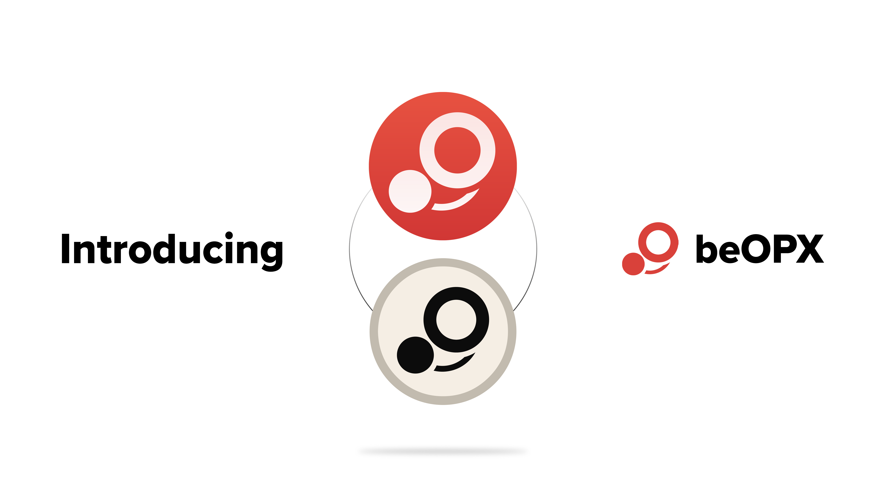

# beOPX

## What is OPX?

OPX is the native token of OPX Finance, a decentralised spot and perpetual exchange native to the Optimism blockchain. The OPX token is used to reward holders with a share of protocol revenues, whilst providing voting rights for use in protocol governance. OPX has adopted a fixed token supply model, though the current OPX token incorporates both minting and burning methods.

OPX offers a novel form of vote escrow tokenomics for its governance and profit share mechanics. This requires holders to stake and lock both their OPX tokens and an OPX NFT with the protocol. For this, holders receive veOPX, which reflects the holder's rights to participate in protocol governance and profits. OPX NFTs can only be obtained from an OPX mystery box (or third party sale) and are minted with a randomised level, which determines the percentage of boost applied to the holder’s veOPX. 

The key governance mechanism of veOPX is to decide on the distribution of OPX tokens among: (1) OPX liquidity (OLP) providers; (2) OPX stakers' profit share; (3) OPX protocol-owned liquidity; (4) OPX's developer treasury; (5) OPX's buy back and burn program; and (6) returning profit to DarkCrypto DAO - the creators of OPX. OPX [staking](https://www.opx.finance/#/stake) and [voting](https://www.opx.finance/#/vote) can can be done through OPX's web app.

veOPX is non-transferrable and the amount held by a given user decreases steadily to zero as the lock period moves towards its completion. Users also cannot liquidate or transfer their locked OPX positions until the end of the time lock.

## What is beOPX?

beOPX is a Beefy-escrowed version of OPX staked for veOPX to take advantage of the various benefits offered to OPX stakers. As Beefy holds an OPX NFT of top-tier rarity (level 5), beOPX gives holders access to the maximum boosted profit share, which otherwise is reserved for the lucky few who acquire a similar rare NFT.

The token is fully backed 1:1 with OPX and can be redeemed for OPX held in reserve. This reserve fills up in several circumstances:

1. when new users deposit OPX into beOPX, if below the required reserve amount at the time; 
2. when the contract harvests protocol revenues from OPX, if below the required reserve amount at the time; or
3. if the contract's staked OPX is left to gradually unlock.

<figure><figcaption>
beOPX is designed to capture the maximum possible rewards and benefits from OPX's vote escrow tokenomics.
</figcaption></figure>

## How does one get beOPX?

You can mint beOPX on the beOPX vault page at a 1:1 ratio. There is no incentivised liquidity for beOPX, instead there will be a withdrawal reserve.

## How does beOPX work?

When you mint beOPX, the contract will immediately try to stake and lock the deposited OPX into veOPX, subject to the required reserve being maintained.

If the contract's OPX reserves at the time of minting exceed the required reserve amount (which is currently 30% of the contract's veOPX), the contract can stake any excess OPX into veOPX. If the OPX reserves are under the required reserve amount, then the deposited OPX will be added to the reserve to cover the current shortfall.

Once the contract's OPX is staked and locked into veOPX, it receives a proportion of OPX protocol revenues which have been allocated for stakers, together with the ability to vote on future distributions of protocol revenue among the different available options.&#x20;

As the beOPX contract perpetually re-locks its OPX deposits, it always strives for the maximum amount of voting power and protocol revenues. Earned revenues are regularly harvested, swapped for beOPX and redeposited to the beOPX vault to autocompound the return for beOPX stakers.

## How can I earn with my beOPX?

Once you're holding beOPX, you can stake it in our beOPX vault to earn more beOPX.&#x20;

Where our beOPX contract earns protocol revenues by deploying its veOPX on the protocol, those protocol revenues are swapped back to beOPX and redeposited into the beOPX vault to give rise to an autocompounding effect. This maximises the yield for holders above what they could obtain alone from the protocol.

## But what about fees?

Beefy strives to maintain some of the lowest yield-optimizing fees, and charges standard fees on its beOPX vault.

## How does beOPX keep its peg?

There's no liquidity provided for beOPX, so it will always be at 1:1 with OPX. Users can burn beOPX for OPX while the reserve lasts without affecting the peg.&#x20;

## How can I get my OPX back?

Whilst there are OPX tokens available in the reserve, you will be able to burn your existing beOPX tokens (up to the amount of the reserve) to receive back an equivalent amount of OPX.

Where the reserve does not hold sufficient OPX tokens to facilitate the requested withdrawal, you will only be able to withdraw up to the amount of the reserve.  Users can then wait until the next harvest of protocol revenues, which will refill the reserve and allow them to burn their beOPX. Otherwise, OPX's locking mechanism does not include an emergency release mechanism.

As the required reserve amount is tied to the amount of veOPX held by the contract, and all veOPX balances reduce over time as the time left until unlock decreases, the amount of reserve required will also naturally decrease over time until the veOPX lock is extended. As such, and assuming that no further OPX deposits are made to replenish the reserve, the required reserve amount will gradually decrease over time, meaning the amount of OPX available to withdraw will increase constantly.&#x20;

## Can I vote with my beOPX?

No. All OPX voting power will be used by Beefy to vote in the protocol revenue distribution votes. Voting takes place on OPX's [web app](https://www.opx.finance/#/vote).
