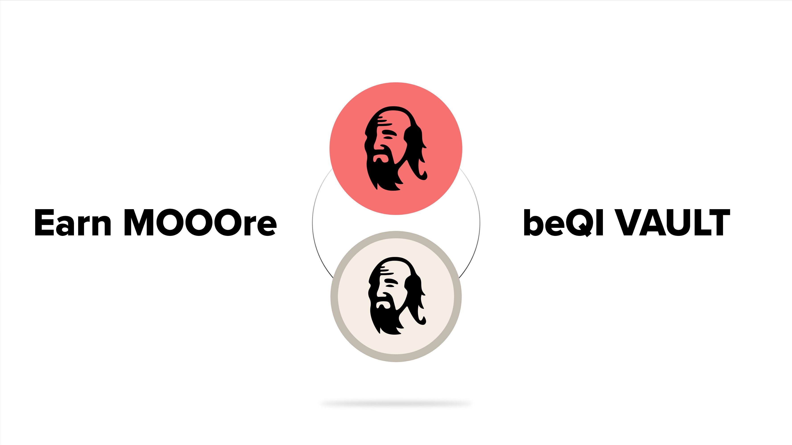
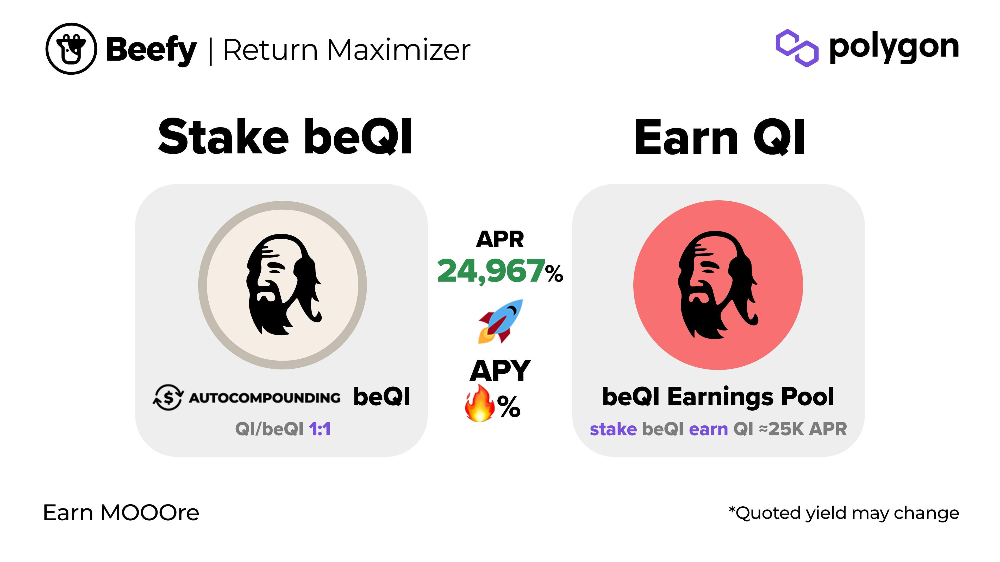

# beQI

## What is Qi?

Qi is the native token of Mai Finance, a collateralised debt protocol native to the Polygon blockchain. Mai Finance is governed by QiDao, for which Qi is the governance token. Qi can also be used to participate in a share of the protocol's revenues. Qi has a fixed supply and decaying emissions model.

Users can stake Qi to earn eQi and receive an up to 4x boosted share of protocol revenues and governance voting power.

## What is beQI?

beQI is a Beefy-escrowed version of Qi staked to earn eQi, to boost the proportion of Mai Finance protocol revenues that Beefy earns and to participate in vault incentive gauge votes.

The token is fully backed 1:1 by Qi and can be redeemed for Qi held in reserve. This reserve fills up when new users deposit (if below the required reserve amount at the time), or the amount of reserve required gradually decreases as the contract's eQi gradually decreases and unlocks.

## How does one get beQI?

You can mint beQI on the beQI [vault](https://app.beefy.finance/#/vault/beefy-beqi) or [earnings pools](https://app.beefy.finance/#/vault/beefy-beqi-earnings) pages at a 1:1 ratio. There is no incentivised liquidty for beQI, instead there will be a withdrawal reserve.

## How does beQI work?

When you mint beQI, the contract will immediately try to stake and lock the deposited Qi into eQi, subject to the required reserve being maintained.

If the contract's Qi reserves at the time of minting exceed the required reserve amount (which is currently 20% of the contract's eQi), the contract can stake any excess Qi into eQi. If the Qi reserves are under the required reserve amount, then the deposited Qi will be added to the reserve to cover the current shortfall.

Once the contract's Qi is staked and locked into eQi, it receives two benefits: (1) boosted weekly protocol revenue rewards; and (2) voting rights in QiDao's governance and vault incentives gauge votes. Beefy's approach to voting for beQI is detailed [below](beqi.md#can-i-vote-with-beqi).

Mai Finance protocol revenues are paid out weekly, and currently include 100% of all farming rewards from the protocol's deposit fee revenue, which is used to farm Qi-MATIC, together with 30% of the debt repayment fees for all collateral types (plus a 25% weekly bonus). Individual rewards can be boosted by up to 4x where a user has the maximum amount of eQi (i.e. has locked their Qi for 4 years).&#x20;

As the beQI contract perpetually re-locks its Qi deposits, it always strives for the maximum amount of boost. All of our received rewards are then distributed to our Beefy beQI vault and earnings pool for the benefit of beQI holders.

## How can I earn with my beQI?

Once you're holding beQI, there are a couple of available options. You can either:

1. Stake it in the beQI vault to earn more beQI; or
2. Stake it in the beQI earnings pool to earn Qi.

As eQi boosted protocol revenue is paid out in Qi tokens, these can be paid back to beQI holders either directly in Qi (through the earnings pool), or by compounding beQI (through the vault) by minting more beQI with the Qi rewards.

## How does the beQI strategy work?

## But what about fees?

Beefy strives to maintain some of the lowest yield-optimizing fees, and charges standard fees on its beQI vaults.

## How does beQI keep its peg?

There's no liquidity provided for beQI, so it will always be at 1:1 with Qi. Users can burn beQI for Qi while the reserve lasts without affecting the peg.

## How can I get my Qi back?

Whilst there are Qi tokens available in the reserve, you will be able to burn your existing beQI tokens (up to the amount of the reserve) to receive back an equivalent amount of Qi.

Where the reserve does not hold sufficient Qi tokens to facilitate the requested withdrawal, you will only be able to withdraw up to the amount of the reserve. Unfortunately, eQi locking also does not include an emergency release mechanism, so in this scenario holders will need to wait until the reserve is replenished.

As the required reserve amount is tied to the amount of eQi held by the contract, and all eQi balances reduce over time as the time left until unlock decreases, the amount of reserve required will also naturally decrease over time until the eQi lock is extended. As such, and assuming that no further Qi deposits are made to replenish the reserve, the required reserve amount will gradually decrease over time, meaning the amount of Qi available to withdraw will increase constantly.&#x20;

## Can I vote with beQI?

Not at the moment. All Qi voting power is currently used by Beefy to vote in the weekly vault incentives gauge. Votes will typically be directed to Beefy collateral types (e.g. mooBIFI Fantom), which rewards our users who deposit their Beefy assets as collateral on Mai Finance.

Where our preferred collateral types are unlikely to qualify for the incentives gauge, we may also choose to accept bribes from external parties. The proceeds of all bribes are then distributed directly to our beQI holders. If you are interested in proposing a bribe to Beefy, please reach out to the Core team on Discord, Telegram or Twitter to find out more.

