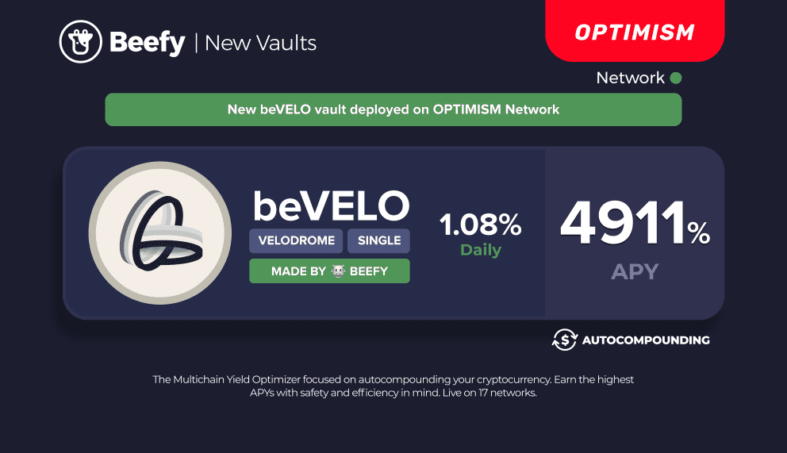

# beVELO

## What is VELO?

VELO is the native token of Velodrome Finance, a decentralised trading and liquidity marketplace native to the Optimism blockchain. It rewards holders with a share of the platform's revenues and also acts as a governance token for its weekly pool incentives gauge. VELO has a fixed supply and decaying emissions model.

Users can stake and lock their VELO tokens on Velodrome for a fixed period between 1 week and 4 years, to receive a vote escrow NFT ("**veNFT**"), which is used to record the amount of veVELO held by the user. veVELO holders receive three benefits: (1) a share of the trading fees from swaps using the platform's liquidity pools; (2) the ability to direct VELO emissions distributed to platform liquidity providers; and (3) the opportunity to earn bribes from external parties by voting for their incentivised liquidity pools. VELO staking can can be done through Velodrome's [web app](https://app.velodrome.finance/vest).

veVELO is non-transferrable and the amount held by a given user decreases steadily to zero as the lock period moves towards its completion. Users also cannot liquidate or transfer their locked VELO positions until the end of the time lock.

## What is beVELO?

beVELO is a Beefy-escrowed version of VELO staked for veVELO to take advantage of the various benefits offered to Velodrome stakers.

The token is fully backed 1:1 by VELO and can be redeemed for VELO held in reserve. This reserve fills up on several circumstances:

1. when new users deposit VELO into beVELO, if below the required reserve amount at the time;&#x20;
2. when the contract harvests trading fees and bribes from Velodrome (which occurs after the epoch turns over on thursday at 00:00 UTC), if below the required reserve amount at the time; or
3. if the contract's staked VELO is left to gradually unlock.

<figure><figcaption>
beVELO is designed to capture the maximum possible rewards and benefits from Velodrome's vote escrow tokenomics.
</figcaption></figure>

## How does one get beVELO?

You can mint beVELO on the beVELO [vault page](https://app.beefy.finance/vault/beefy-bevelo) at a 1:1 ratio. There is no incentivised liquidity for beVELO, instead there will be a withdrawal reserve.

## How does beVELO work?

When you mint beVELO, the contract will immediately try to stake and lock the deposited VELO into veVELO, subject to the required reserve being maintained.

If the contract's VELO reserves at the time of minting exceed the required reserve amount (which is currently 20% of the contract's veVELO), the contract can stake any excess VELO into veVELO. If the VELO reserves are under the required reserve amount, then the deposited VELO will be added to the reserve to cover the current shortfall.

Once the contract's VELO is staked and locked into veVELO, it receives three benefits: (1) a share of the trading fees from the platform's liquidity pools; (2) the ability to direct VELO emissions distributed to liquidity pool stakers; and (3) the opportunity to earn bribes from external parties by voting for their incentivised liquidity pools.

As the beVELO contract perpetually re-locks its VELO deposits, it always strives for the maximum amount of voting power and benefits. Earned trading fees and bribes are regularly harvested, swapped for beVELO and redeposited to the beVELO vault to autocompound the return for beVELO stakers.

## How can I earn with my beVELO?

Once you're holding beVELO, you can stake it in our beVELO vault to earn more beVELO.&#x20;

Where our beVELO contract earns trading fees and bribes by deploying its veVELO on the protocol, those protocol revenues are swapped back to beVELO and redeposited into the beVELO vault to give rise to an autocompounding effect. This maximises the yield for holders above what they could obtain alone from the protocol.

<figure><figcaption>
beVELO can be deposited into our beVELO vault, where the earnings from staking the contract's VELO into veVELO are redeposited and autocompounded.
</figcaption></figure>

## But what about fees?

Beefy strives to maintain some of the lowest yield-optimizing fees, and charges standard fees on its beVELO vault.

## How does beVELO keep its peg?

There's no liquidity provided for beVELO, so it will always be at 1:1 with VELO. Users can burn beVELO for VELO while the reserve lasts without affecting the peg.&#x20;

## How can I get my VELO back?

Whilst there are VELO tokens available in the reserve, you will be able to burn your existing beVELO tokens (up to the amount of the reserve) to receive back an equivalent amount of VELO.

Where the reserve does not hold sufficient VELO tokens to facilitate the requested withdrawal, you will only be able to withdraw up to the amount of the reserve.  Users can then wait until the next harvest of trading fees and bribes, which will refill the reserve and allow them to burn their beVELO. Otherwise, Velodrome's locking mechanism does not include an emergency release mechanism.

As the required reserve amount is tied to the amount of veVELO held by the contract, and all veVELO balances reduce over time as the time left until unlock decreases, the amount of reserve required will also naturally decrease over time until the veVELO lock is extended. As such, and assuming that no further VELO deposits are made to replenish the reserve, the required reserve amount will gradually decrease over time, meaning the amount of VELO available to withdraw will increase constantly.&#x20;

## Can I vote with my beVELO?

No. All VELO voting power will be used by Beefy to vote in the weekly liquidity pool incentives gauge.&#x20;

Votes will typically be directed either to the liquidity pools offering the most in trading fees and bribes, or to the liquidity pools which support our BIFI token (e.g. BIFI-OP LP). The beVELO contract will harvest all trading fees and bribes from the protocol and swap those for more VELO to autocompound in the beVELO vault (thus increasing yield for holders). Voting on Velodrome's incentivised liquidity pools takes place on its [web app](https://app.velodrome.finance/vote).

If you are interested in proposing a bribe to Beefy, please reach out to the Core team on Discord, Telegram or Twitter to find out more.
