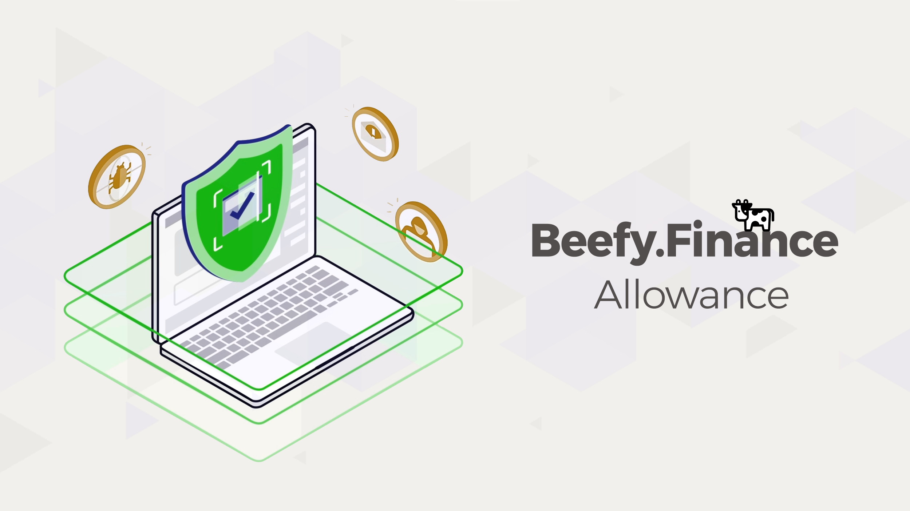

# Token Allowance

Beefy Allowance allows you to revoke wallet access from previously Authorized Spenders.

* Site: [https://allowance.beefy.finance/](https://allowance.beefy.finance/)

Forked from a [token allowance checker](https://tac.dappstar.io/#/) on Ethereum, this tool is used to revoke spend permissions from DApps that your wallet has previously interacted with. Leaving these spend permissions enabled could allow dishonest teams or individuals to transfer all of your approved tokes at anytime without asking further permission from you. This tool is similar to the DeBank Approval tool and [unrekt.net](https://app.unrekt.net/).
