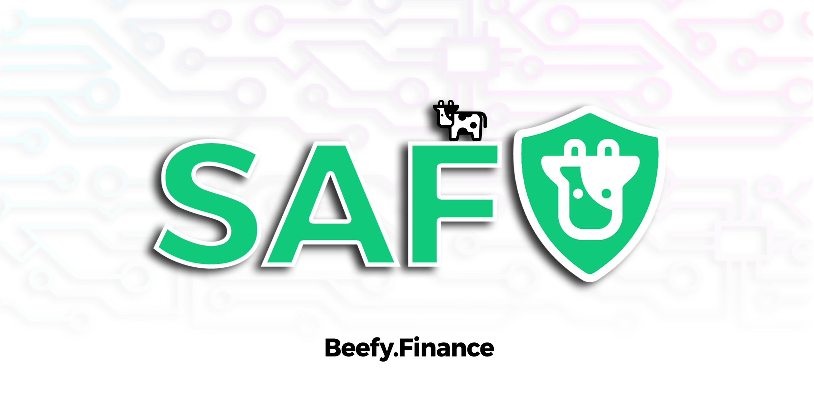

# Резервный доступ к Beefy

Иногда, пользователи при попытке зайти на сайт децентрализованного приложения Beefy видят белый или черный экран, в связи с чем не могут получить доступ к своим средствам.

Это может быть связано с техническими работами, производимыми на серверах Fleek или Cloudflare, но порой очень трудно определить причину сбоя. Такие случаи обычно затрагивают конкретные регионы, но не весь земной шар. Мы понимаем, что такая ситуация не может не расстраивать!

Прежде всего, _не беспокойтесь_, ваши средства надежно хранятся на блокчейне. Они не находятся на сайте Beefy. Сайт Beefy лишь выступает в качестве интерфейса, упрощающего вам доступ к своим средствам.

Если вы испытываете неполадки, описанные выше то попробуйте воспользоваться следующим официальным зеркалом нашего сайта: [https://beefy.on.fleek.co/](https://beefy.on.fleek.co) или воспользуйтесь VPN.

Сайт-зеркало — это версия от разработчиков, которую мы предлагаем использовать для резервного доступа тем пользователям, у которых проблемы с основным сайтом. И помните, что наш сайт **никогда** не потребует от вас внести свою сид-фразу или приватный ключ.
