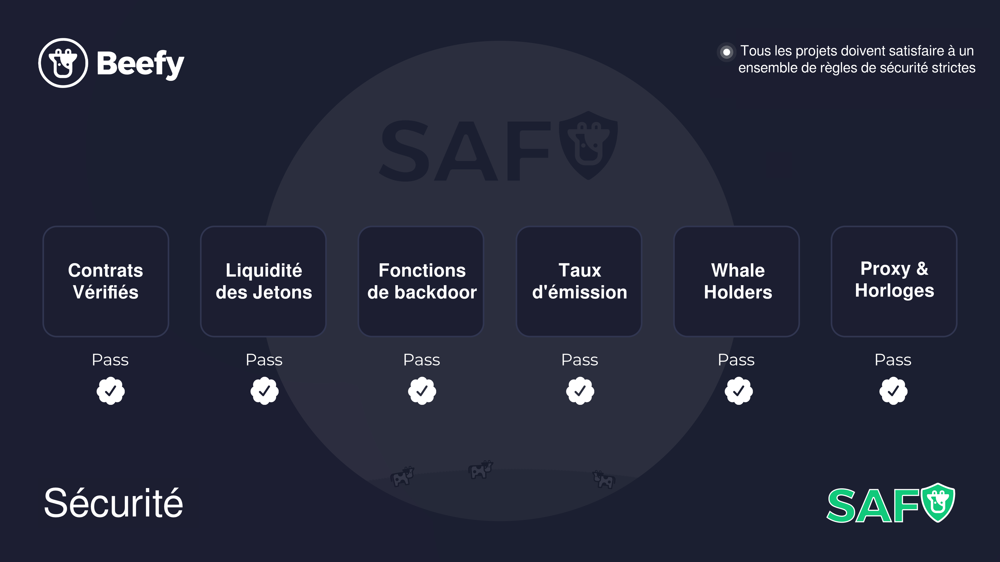

# Les Pratiques SAFU Beefy

## Nouvelles fermes sur Beefy

Avant qu'une nouvelle ferme ne soit mise en place sur Beefy, le projet doit passer un ensemble de règles strictes de la SAFU :

* Les contrats ont été vérifiés dans l'explorateur de blocs ;
* Les jetons non-natifs doivent provenir de ponts réputés ;
* Suffisamment de liquidités pour échanger des récompenses en jetons de ferme ;
* Les fonctions d'agression et de migration sont soit complètement supprimées, soit suffisamment limitées dans le temps ;
* Les taux d'émission de jetons de ferme doivent être verrouillés dans le temps (si les paires de jetons de ferme sont mises en sécurité) ;
* Les détenteurs de jetons de ferme avec >5% d'approvisionnement en circulation ne sont pas des EOA ou des multi-signatures ;
* Tous les changements de mise en œuvre du proxy doivent être verrouillés dans le temps.

## Nouveaux coffres sur Beefy

Nos stratèges suivent une procédure de test manuel pour chaque nouveau coffre, avant sa mise en service. Cela permet de s'assurer que le coffre fonctionne comme prévu et que les fonds des utilisateurs sont toujours protégés.
1. Déposer un petit montant de l'actif ;&#x20;
2. Retirez tout ;&#x20;
3. Déposez à nouveau, attendez 1 minute et vérifiez que `callReward()` est différent de 0 ;&#x20;
4. Récoltez la stratégie ;&#x20;
5. Passez en panique la stratégie ;&#x20;
6. Retirer 50% pendant la panique pour s'assurer que les utilisateurs peuvent partir ;&#x20;
7. Essayez de déposer, une erreur devrait s'afficher mais n'envoyez pas le dépôt ;&#x20;
8. Mettez la stratégie en pause ;&#x20;
9. Déposez les 50% qui ont été précédemment retirés et récoltez à nouveau.

## Améliorations de la stratégie

De temps en temps, les experts en stratégie de Beefy sortent une nouvelle stratégie innovante, ou les fermes de rendement changent leurs contrats de récompense. Si c'est le cas, les coffres Beefy ont la flexibilité de s'adapter à ces changements, et ont la capacité d'échanger des stratégies afin que les utilisateurs n'aient pas à migrer leurs fonds vers un nouveau coffre : cela est fait automatiquement par une mise à jour de la stratégie.

La nouvelle stratégie est déployée avec un coffre factice et tous les tests manuels décrits ci-dessus sont effectués. Après avoir passé les contrôles, la nouvelle stratégie est affectée au coffre. Le coffre se voit proposer la nouvelle stratégie par le biais d'un portefeuille à signatures multiples et doit attendre que le délai de verrouillage soit passé avant que le coffre n'utilise la nouvelle stratégie.

## Panique

Parfois, quelque chose peut mal tourner avec la ferme de rendement sous-jacente, et il est très important de réagir rapidement. Les stratégies Beefy ont un gardien qui est autorisé à paniquer, ce qui retire les fonds misés de la ferme pour les remettre dans le contrat de stratégie et supprimer toutes les allocations. Cela permet de s'assurer que les fonds sont toujours disponibles pour que les stakers Beefy puissent les retirer en cas d'urgence.
