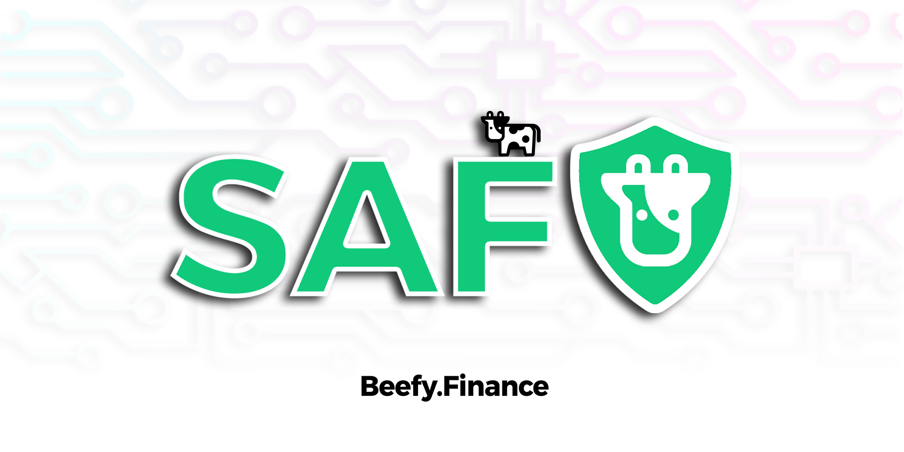

# Beefy SAFU Practices

## New farms on Beefy

Before a new farm gets vaulted on Beefy, the project has to pass a stringent set of SAFU rules:

* Contracts have been verified in the block explorer;
* Non-native tokens must be from reputable bridges;
* Enough liquidity for swapping farm token rewards;
* Rug/migrator functions are either completely removed or timelocked sufficiently;
* Farm token emission rates have to be timelocked (if farm token pairs are being vaulted);
* Farm token holders with >5% circulating supply are not EOAs or multi-sigs;
* All proxy implementation changes must be timelocked.

## New vaults on Beefy

Our strategists follow a manual testing procedure on every new vault before it goes live. This is to ensure that the vault works as intended and user funds are always SAFU.

1. Deposit a small amount of the asset;&#x20;
2. Withdraw all;&#x20;
3. Deposit again, wait 1 minute and check that `callReward()` is not 0;&#x20;
4. Harvest the strategy;&#x20;
5. Panic the strategy;&#x20;
6. Withdraw 50% while panicked to make sure users can leave;&#x20;
7. Try to deposit, an error should pop up but don't send the deposit through;&#x20;
8. Unpause the strategy;&#x20;
9. Deposit the 50% that has previously been withdrawn and harvest again.

## Strategy upgrades

Occasionally, Beefy strategists will come out with a new innovative strategy, or yield farms change their reward contracts. If that's the case, Beefy vaults have the flexibility to adapt to these changes, and have the ability to swap strategies so users don't have to migrate their funds to a new vault: it's done automatically by a strategy upgrade.

The new strategy is deployed with a dummy vault and all of the manual tests outlined above are completed. After passing the checks, the new strategy is assigned to the vault. The vault gets proposed the new strategy through a multi-sig wallet and has to wait until the timelock delay has passed before the vault uses the new strategy.

## Panic

Sometimes something can go wrong with the underlying yield farm, and reacting quickly is of great importance. Beefy strategies have a keeper that is allowed to panic, which withdraws the staked funds from the farm back to the strategy contract and removes all allowances. This ensures that funds are always available for Beefy stakers to withdraw in case of emergency.
