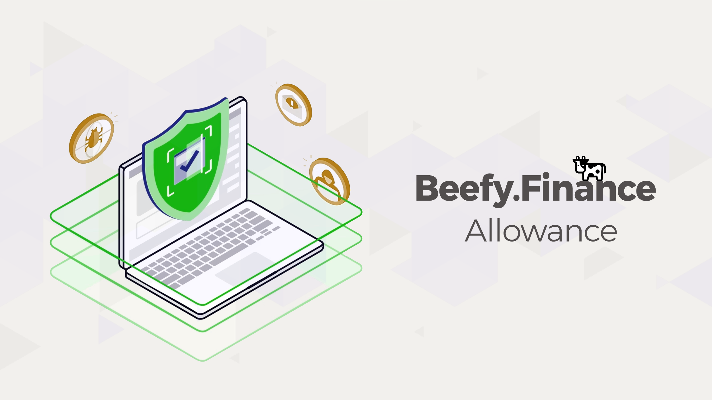

# Разрешения на трату средств

Beefy Allowance позволяет вам отзывать разрешению на трату средств для контрактов, которым вы ранее дали такое право.

* Сайт: [https://allowance.beefy.finance/](https://allowance.beefy.finance)

Будучи форком [token allowance checker](https://tac.dappstar.io/#/) приложения на ETH, этот инструмент позволяет отзывать разрешения на трату средств у децентрализованных приложений, которые были им даны при предыдущем взаимодействии с ними. Оставляя такие разрешения в силе, вы подвергаете свои средств риску быть украденными со стороны отдельных разработчиков или команд, которые могут вывести токены, на трату которых вы дали согласие ранее. Beefy Allowance похож на аналогичные решения от Debank, например Approval tool и на [unrekt.net](https://app.unrekt.net).

